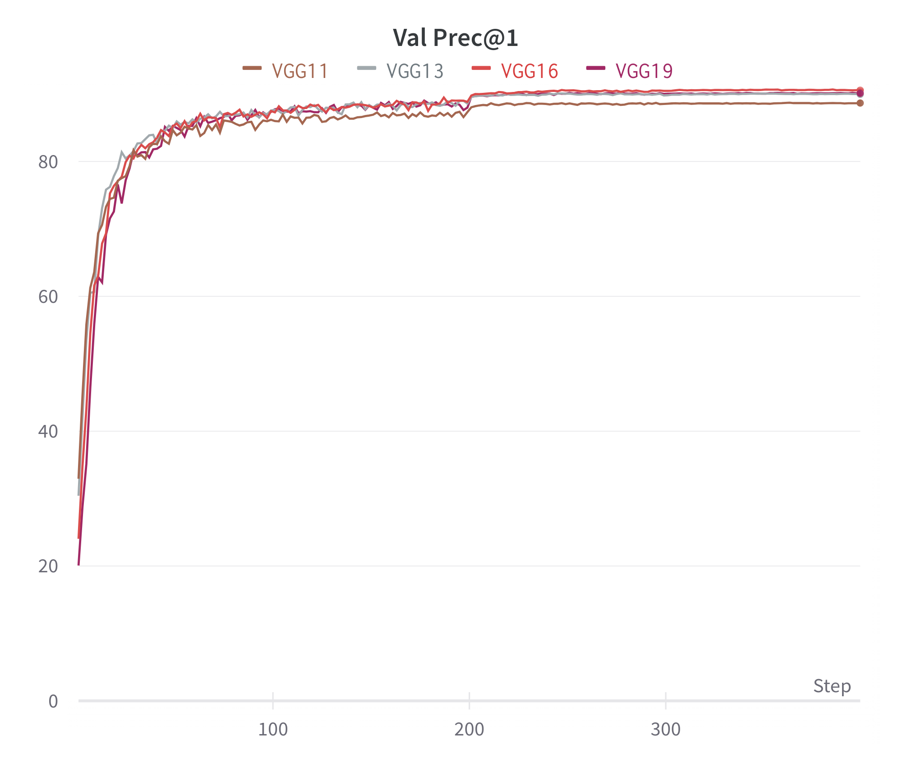

# Result

## VGG

実験結果の詳細はW&BのWorkspaceから確認できます．  
[torch-model Workspace – Weights & Biases](https://wandb.ai/ochiyuma/torch-model?workspace=user-ochiyuma)

|                   | VGG11 | VGG13 | VGG16 | VGG19 | 
| ----------------- | ----- | ----- | ----- | ----- | 
| Best Prec@1       | 87.37 | 90.1  | 90.69 | 90.21 | 
| Training Time [m] | 56    | 65    | 71    | 79    | 




# Run

`torch-model`にいる状態で実行．
```shell
docker run -v $PWD:/opt/project --gpus all --rm torch:dev python3 ./CNN/train.py --CFG_PATH="./CNN/sample_cfg/vgg_debug.yaml"
```

## Reference

- K. Simonyan and A. Zisserman. Very deep convolutional networks for large-scale image recognition. In
ICLR, 2015.